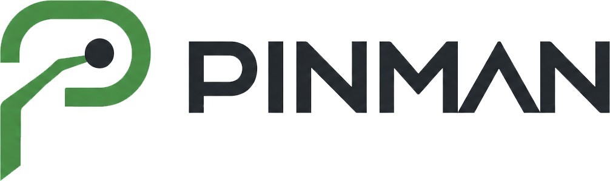

  <picture>
    <source media="(prefers-color-scheme: dark)" srcset="images/pinman-logo-text-dark.png">
    
  </picture>

> The official download and support home for **Pinman 2**.

**Pinman 2** captures, compares, and manages the files and settings that configure a Windows machine — with a remote-control **Operator Mode** and a full **Technician Mode** built in. It is currently in **beta**.

Pinman is closed-source software by [Parkerhill Technology Corporation](https://parkerhill.com). This repository does **not** contain source code — it exists to distribute releases (installer + kits) and to track bug reports and feature requests.

📖 **Website & documentation:** [pinmantech.com](https://pinmantech.com)

---

## Downloads

### Pinman 2 installer

Pinman 2 is in **beta**. Builds are published on the
**[Releases](../../releases)** page — installer plus checksums, with notes for each
one. Versions are dated: `2.0.<YYMMDD>`.

| Package | Status |
|---|---|
| Pinman 2 — installer |  |
| Pinman 2 + BallerInstaller bundle |  |

🧪 **[Join the beta program](https://pinmantech.com/beta)** — so we can tell you when builds land and hear back when something breaks.

> **This is beta software.** It reads and writes real configuration — files, registry keys, and Windows settings. (Read-only mode is on by default, disable for writes). Back up anything you can't afford to lose, and prefer a machine you can rebuild over your only working setup. For a safe introduction, install the **Basics** tutorial project (`pinman tutorial install basics`) — a disposable, read-only sample that touches nothing real — and follow along with the walkthrough in the [docs](https://pinmantech.com/docs).

> **Windows SmartScreen note:** the installer is signed by *Parkerhill Technology Corporation*, but you may still see "Windows protected your PC" until the signature builds download reputation — click **More info → Run anyway**, and check the publisher named in the prompt is Parkerhill.

### Kits

Kits teach Pinman the files and settings that matter for a particular software ecosystem — schemas, profiles, and guidance you install into any Pinman 2 installation. Publicly available kits are on the **[Releases](../../releases)** page.

<!--
| Kit | Status |
|---|---|
| Example Kit (authoring scaffold) |  |
| BallerInstaller Kit — virtual pinball |  |

-->

Install a downloaded kit with `pinman kit install <file>.zip --add`. Community-contributed kits are labeled separately from kits tested and released by Pinman.

### System requirements

- Windows 10 or 11 (64-bit)

---

## Support & bug reports

- 🐞 **Found a bug?** [Open an issue](../../issues/new/choose).
- 🔎 Browse existing reports: [open issues](../../issues?q=is%3Aissue+is%3Aopen).
- 💬 **Question or need help?** Check [Discussions](../../discussions) or see [SUPPORT.md](SUPPORT.md).
- 🗺️ **What's coming next?** See the [ROADMAP](ROADMAP.md).
- 📝 **Release history:** see the [CHANGELOG](CHANGELOG.md).

> **This is a public issue tracker.** Please don't include private or proprietary information in reports. If a detail matters but can't be public, omit it and email it to <jonathan@pinmantech.com>, mentioning the issue number.

Please include your Pinman version and Windows version when reporting a problem.

## License

Pinman is proprietary software. See [LICENSE.txt](LICENSE.txt). All rights reserved.
